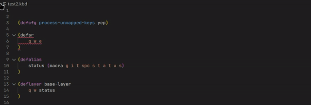

# vscode-kanata

<!--  -->
<!--  -->

A VS Code extension that adds language support for [kanata](https://github.com/jtroo/kanata) configuration files.

This extension aims to stay up-to-date with latest kanata git.
Whenever something changes in `parser` folder in kanata repository, at the end of the day,
Github Actions will automatically build a new version of this extension with updated parser.

## Features

Kanata config files are detected by `.kbd` file extension.

### Syntax highlighting

keywords, action identifiers, alias handles etc.

### Checking for config errors

Config will be parsed and validated, when saving document.

### Support for including other files

If you use [`include`](https://github.com/jtroo/kanata/blob/main/docs/config.adoc#include-other-files)
configuration items in your kanata config, make sure to adjust the following settings:
- `vscode-kanata.includesAndWorkspaces`
- `vscode-kanata.mainConfigFile`

Important: Absolute paths in `include` blocks that point outside the opened workspace aren't supported.

Also, if you work with multiple main files, and find yourself switching `mainConfigFile` often,
there's a handy command palette entry:
- `Kanata: Set current file as main`

## Contributing

If you have an idea what could be improved, feel free to open an issue or a PR.

### Bug reports

If you encounter a bug, please report it here: https://github.com/rszyma/vscode-kanata/issues

### Building

See [this document](CONTRIBUTING.md) for build instructions.

## Release notes

See the [change log](CHANGELOG.md).

## Credits

- https://github.com/jtroo/kanata/ - provides kanata-parser crate
- https://github.com/osohq/oso - used this as vscode extension template (with a lot of things removed)
- https://github.com/canadaduane/vscode-kmonad - syntax highlighting config
- https://github.com/jtroo/kanata/blob/main/assets/kanata-icon.svg - kanata icon
- https://github.com/entibo/vscode-kmonad-format - the idea of formatting `deflayer`s according to spacing in `defsrc`